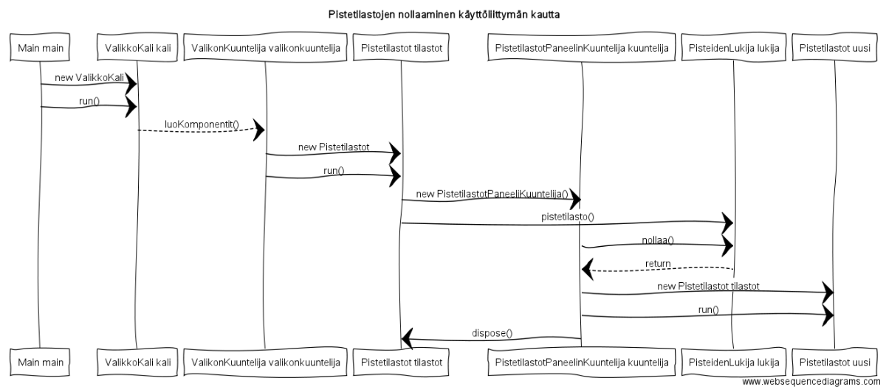
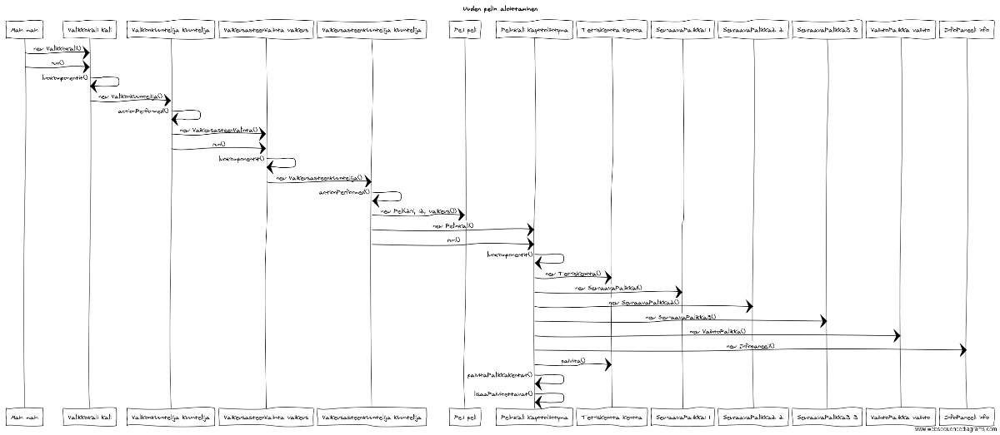
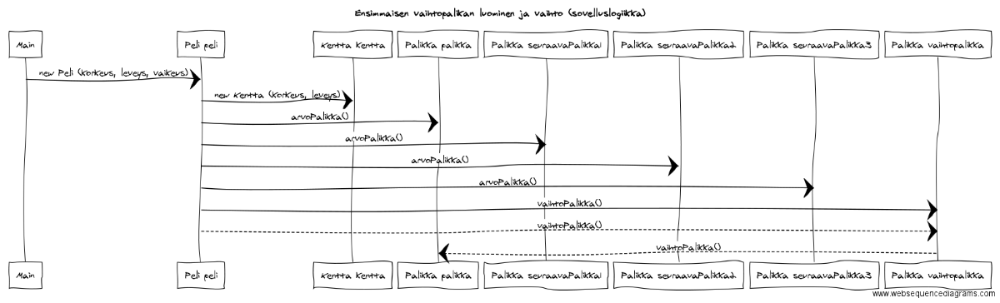

# Aiheen kuvaus ja rakenne

**Aihe:** tetris. Toteutetaan ohjelma, jonka toimintatarkoitus on olla tuttu tetrispeli. Pelissä on tarkoitus järjestää putoavia erimuotoisia palikoita siten, että ne muodostavat täysiä rivejä ja katoavat. Mikäli yhdellä kerralla saa poistettua useita rivejä, pelaaja saa enemmän pisteitä. Mikäli alue jolle palikat putoavat täyttyy vähintään yhdestä rivistä täyteen peli loppuu. Tarkoituksena olisi pitää tallella 5 parasta suoritusta pelin päätyttyä.
	Kun peli etenee palikat putoavat nopeammin alas, ja täten myös yksittäisen poistetun rivin pistemäärä kasvaa. Tarkoituksena olisi voida valita eri vaikeusasteita, eli putoamisnopeuksia.

**Käyttäjät:** Pelaaja

**Toiminnot:** Pelaaja aloittaa pelin valitsemallaa vaikeusasteella. Voidaan myös selata huipputuloksia ja nollata ne haluttaessa.

**Rakennekuvaus:** Ohjelman koodi on jaettu 4 eri pakettiin. Näistä suurimmat ovat labratetris.gui ja labratetris.logiikka paketit, joiden sisällä on vielä lisää paketteja. Ohjelman toiminta alkaa ValikkoKali-luokasta luokan komponentteja käytettäessä hyödynnetään ValikonKuuntelija-luokkaa. Tämän luokan kautta päästään katselemaan pistetilastoja tai pelaamaan varsinaista peliä. Kaikki pelin graafista käyttöliittymää toteuttavat luokat löytyvät labratetris.gui.peli-paketista. Paketista löytyvä PelinKali-luokka yhdistää
 Infopaneeli-, NaytaSeuraavaPalikka1-, NaytaseuraavaPalikka2-, NaytaSeuraavaPalikka3-, NaytaVaihtoPalikka- sekä TetrisKentta-luokkien muodostamat graafiset komponentit yhteen kokonaisuuteen. Kaikki paloja piirtävät luokat hyödyntävät PalojenVarit-luokkaa palojen värittämiseen. 

	Pelin sovelluslogiikkaa pyörittävät luokat löytyvät labratetris.logiikka-paketista. Tämän paketin sisältä löytyvät yksittäisiä paloja pyörittävä luokka Pala, sekä pelikenttää ja siihen pelin kuluessa lisättyjä paloja käsittelevä luokka Kentta.
pakentin sisältä löytyy myös labratetris.logiikka.palikat-paketti, jonka sisältä löytyy abstrakti luokka Palikka, joka vastaa kaikkien erimuotoisten palikoiden yhteisistä toiminnoista. Kaiken muotoisille palikoille löytyy myös omat luokkansa, jotka ohjaavat tetramiinoihin kuuluvien palojen rotaatiota, sekä aloituspaikkoja. Myös enum Vari, jolla määritetään erimuotoisten tetramiinojen väri, sekä enum Kulma joka kertoo tetramiinon rotaation tilasta. Koko peliä pyörittävänä moottorina toimii luokka Peli. Tässä luokassa
 tapahtuu vaikeusasteen mukaan pelin siirtyminen eteenpäin, käyttäjän komentojen kuuntelu, sekä koko sovelluslogiikan kasaaminen yhdeksi toimivaksi kokonaisuudeksi.
	
	ValikkoKali-luokasta siirryttäessä pistetilastojen tarkasteluun hyödynnetään labratetris.gui.pistetilastot-paketin luokkia. Kaikki pistetilastoja käsittelevät luokat hyödyntävät labratetris.lukija-paketsita löytyvää PisteidenLukija-luokkaa. Tämä luokka lukee pistetilastot.txt tiedoston sisältöä, sekää kirjaa sinne uudet ennätykset, ja nollaa ne oletustilaan sitä haluttaessa. Näitä toimintoja käyttöliittymässä esittävät luokat ovat Pistetilastot-luokka, joka esittää listauksena top 5 tulokset, PistetilastotPaneelinKuuntelija-luokka, joka antaa Pistetilastot-luokan takaisin ja nolla JBUttoneille toiminnallisuudet.
UusiEnnätys-luokka, jota käytetään pelin loputtaessa mikäli pelin aikana saavutetut pisteet yltävät top 5 listalle, ja UudenEnnätyksenKuuntelija, joka kutsuu PisteidenLukija-luokkaa joka kirjaa ennätyksen.

**Käyttöohjeet:** Ohjelman käynnistäessä aukee valikkonäkymä, jossa on kolme vaihtoehtoa Uusi peli, Pistetilastot ja poistu. Mikäli näistä vaihtoehdoista valitsee ensimmäisen vaihtoehdoista aukeaa näkymä josta voi valita vaikeusasteen 1-6, joista 1 on helpoin ja 6 vaikein. Vaikeusaste vaikuttaa nopeuteen, jolla tetramiinot putoavat alas pelin alussa. Kun vaikeusaste on valittu aukeaa varsinaisen pelin graafinen käyttöliittymä. Pelissä voi liikuttaa tetramiinoja nuolinäppäimillä siten, että luonnollisesti vasen nuoli siirtää tetramiinoa yhden ruudun verran vasemmalle, oikea nuoli yhden ruudun verran oikealle ja alanuoli yhden ruudun verran alaspäin. Ylänuoli pudottaa tetramiinon kokonaan alas. Tetramiinoja voi pyörittää näppäimellä . ja tämän hetkisen tetramiinon voi tallentaa tulevaa käyttöä varten ja aikaisemmin tallenetun tetramiinon voi ottaa käyttöön näppäimellä -.

	Pelin oikella reunalla näkyvät 3 seuraavaa tetramiinoa sekä vaihdettavaksi asetettu tetramiino. Tämän hetkinen vaikeusaste sekä pistemäärä näkyy peli kentän alapuolella. Pelin loputtaessa mikäli pelaajan pistemäärä sijoittuu top 5 listalle, kysytään pelaajan nimimerkkiä ja uusi ennätys tallennetaan. Ennätyksiä voi katsella sekä nollata oletus asetuksille valikon Pistetilastot painikkeesta.

**Luokkakaavio:** .png)
**Sekvenssikaavio pistetilastojen nollaamisesta:** 
**Sekvenssikaavio uuden pelin aloittamisesta:** 
**Sekvenssikaavio vaihtopalikoista sovelluslogiikassa:** 